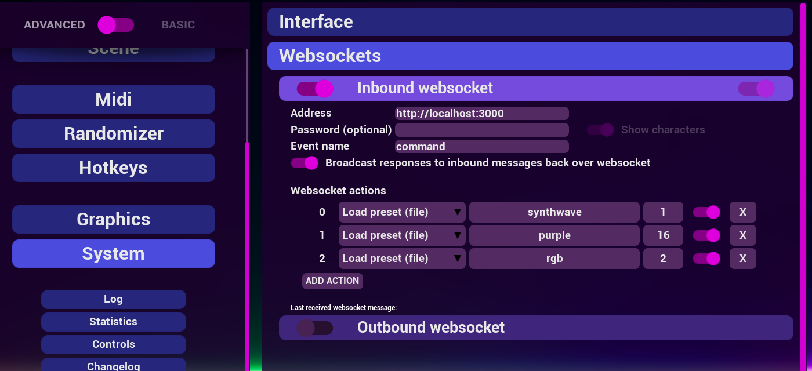

# TouchPortal Keysight Plugin

## Description

This Plugin for [TouchPortal](https://www.touch-portal.com/) adding controls for the piano visualizer [Keysight](https://store.steampowered.com/app/1325730/Keysight/) with the power of websockets and socketIO.

### [Download latest Version](https://github.com/marcus-universe/TouchPortal_KeysightPlugin/releases)

## How to use it?

1. Install the TouchPortal_Keysight_Plugin.tpp in TouchPortal and restart TouchPortal.
2. Install the Keysight_Icon_Pack.tpi

---

3. Set in Keysight under System/Websockets/Inbound websocket the address to `http://localhost:3000` or to your port after `:` when you changed it. Event name is `command`.
4. Now set what messages you wanna listen to and what there need to change.

 
 

**Ports can be changed here**

---

5. Add to your TouchPortal Button a `Send to Keysight` Action and replace the String with you message.

For sending a message to Keysight

For restarting the Websocket Server

6. Have fun jamming 😉

---

## How can you help with the code?

### 1. Fork this repository

### 2. Install the npm dependencies

`npm install`

### 3. After making changes test your code

`npm run build` creates a new touchportal_keysightplugin.tpp in the `Installer` folder.
`npm run runServer` starts a localhost server on Port `3000` and listens to messages with the name `command` to test it.
`npm run start` starts the index.js file for checking if the plugin is working.

### 4. Make a Pull request to submit your changes.

## For more infos look:

- [TouchPortal API Docs](https://www.touch-portal.com/api/)
- [Node JS SDK for TouchPortal](https://github.com/spdermn02/touchportal-node-api)
- [Websockets Docs from Keysight](https://steamcommunity.com/sharedfiles/filedetails/?id=2218116335)

## Special thanks to:

Keysight Discord Server Members
and
HeapUnderflow for providing a [Keysight SocketIO Template](https://gitlab.com/HeapUnderflow/keysight-socket.io-template)
